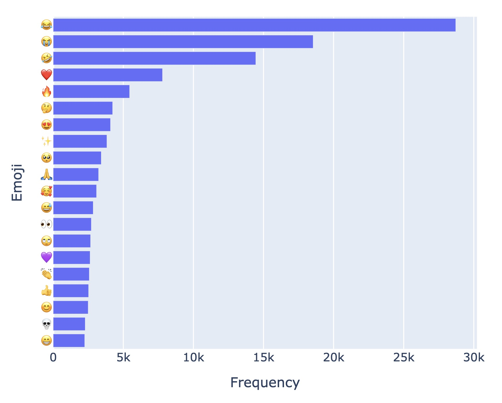
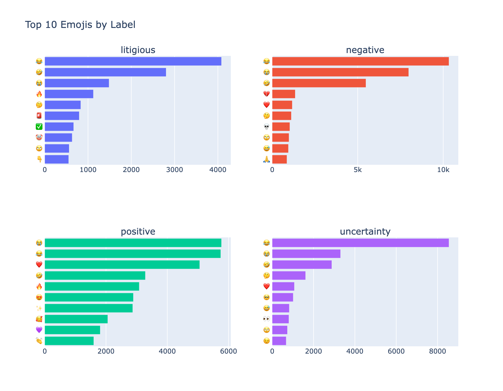
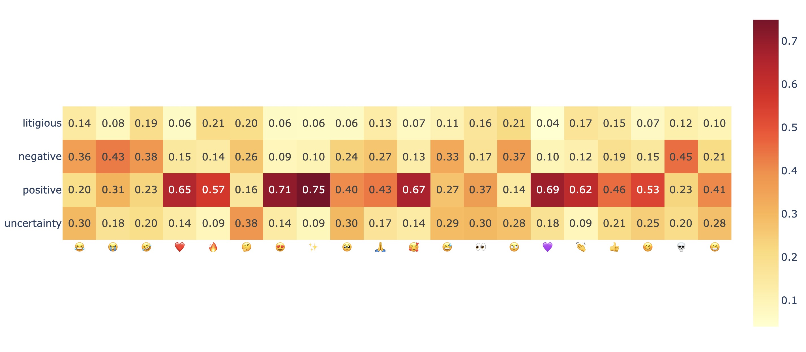
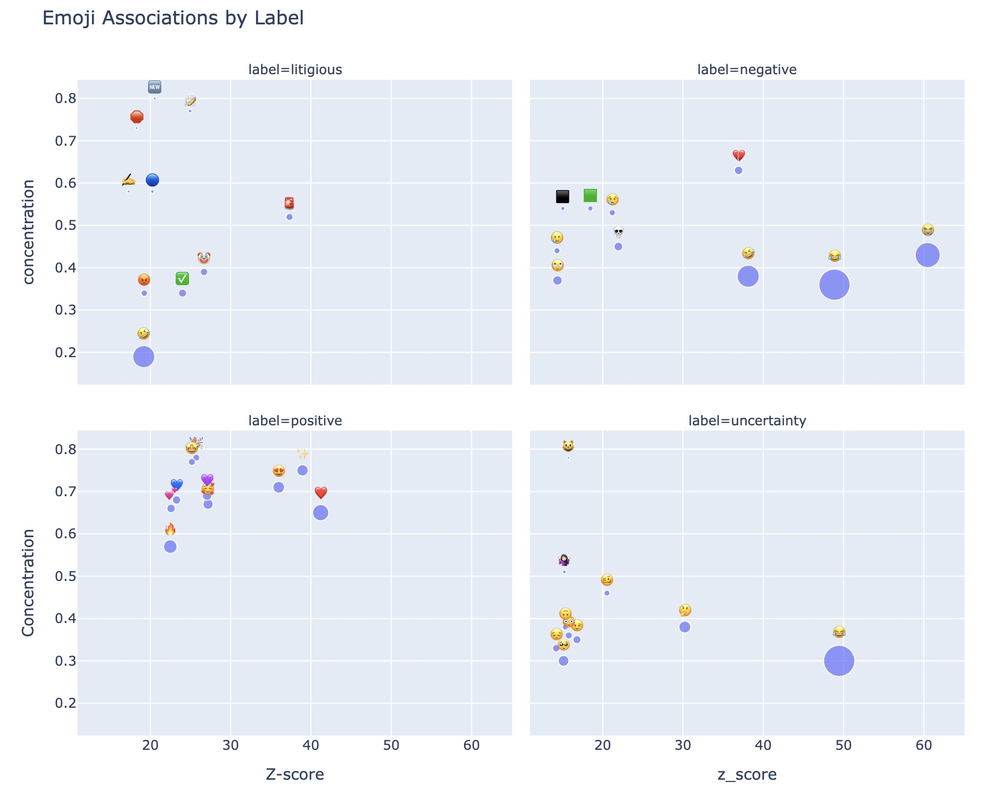

# Emoji Usage Patterns in Tweets

## Project Overview

This project explores how emojis are used in tweets and how their usage
differs across labels. It combines basic exploratory analysis with a
statistical method to identify emojis that are strongly linked to
specific labels.

This project uses the [TweetFeels
1m4](https://huggingface.co/datasets/mnemoraorg/tweetfeels-1m4) dataset
and includes tweets labeled as:

-   `positive`

-   `negative`

-   `uncertainty`

-   `litigious`

## Project Workflow

### 1) Exploratory analysis

Notebook: `01_Emoji_EDA.ipynb`

This notebook:

-   Extract emojis from tweets
-   Analyze how often emojis appear
-   Identify the most common emojis
-   Compare emoji usage across labels
-   Visualize distributions and heatmaps

### 2) Emoji–label association analysis

Notebook: `02_log_odds_analysis.ipynb`

-   Build emoji-by-label count tables
-   Filter rare emojis
-   Apply Dirichlet-smoothed log-odds with z-scores
-   Identify emojis that are strongly linked to each label

## Methods Summary

### Emoji extraction

Tweets are parsed to extract emoji characters from text, then expanded
into an emoji-level table for downstream counting.

### Dirichlet-smoothed log-odds

The second notebook applies a common text-analysis style method for
identifying features that are unexpectedly associated with one category
relative to others.

This method helps identify emojis that are truly linked to a label, not
just common overall.

For example, an emoji like 😂 appears very frequently in all types of
tweets, so high counts alone do not make it a good indicator of any
specific label. In contrast, a less frequent emoji that appears mostly
in one label will be highlighted as more meaningful.

A heatmap based on per-emoji proportions shows how an emoji is
distributed across labels. For example, an emoji might appear 80% in one
label and 10% in the others, which suggests it is associated with that
label.

However, this view does not account for how many emojis are used in each
label overall. If that label already contains a large share of all
emojis, then seeing 80% there may simply reflect its size, not a strong
preference for that emoji.

On the other hand, a smaller label might only account for 10% of the
emoji’s usage, but if that label has very few emojis overall, that 10%
could actually represent relatively frequent use within that label.

Smoothed log-odds measures whether an emoji is used more often in a
given label than in the other labels, while adjusting for overall
frequency and differences in label size.

## Key Findings

-   Most tweets use just one emoji, while only a few use many

-   Some common emojis (like 😂) are used everywhere, across different
    categories

-   Emojis in positive-labeled tweets (like ❤️, ✨) are more consistent
    and mostly used in this label

-   Negative emojis are more intense emotionally, but some are used more
    broadly

-   Litigious emojis are less frequent but still show clear patterns

-   Emojis in uncertainty are more mixed and less specific

## Interactive Visualizations

### Top 20 emojis overall

This figure shows the most frequent emojis in the full dataset.

Interactive version: [Open plot](https://ariafanyang.github.io/emoji-sentiment-analysis/plots/top20_emojis.html)

### Top 10 emojis by label

This plot highlights the most common emojis within each label, making it easier to compare how emoji usage differs across sentiment categories.

Interactive version: [Open plot](https://ariafanyang.github.io/emoji-sentiment-analysis/plots/top10_per_label.html)

### Emoji frequency heatmap

The heatmap gives a cross-label view of emoji usage patterns and helps identify which emojis are broadly used versus label-specific.

Interactive version: [Open plot](https://ariafanyang.github.io/emoji-sentiment-analysis/plots/heatmap.html)

### Emoji-label association

This figure summarizes emoji-label association strength using the z-scores from the log-odds analysis, helping identify emojis that are  each label.

Interactive version: [Open plot](https://ariafanyang.github.io/emoji-sentiment-analysis/plots/emoji_label_association.html)

### Full gallery

You can also browse all interactive plots here: [Open gallery](https://ariafanyang.github.io/emoji-sentiment-analysis/)

## Possible next steps

-   compare emoji patterns by language
-   analyze co-occurring emoji pairs or sequences
-   combine emoji features with text embeddings or bag-of-words features
-   evaluate whether emoji-derived features improve label prediction

## References

-   TweetFeels 1M4 dataset. Available at:
    <https://huggingface.co/datasets/mnemoraorg/tweetfeels-1m4>

-   Monroe, B. L., Colaresi, M. P., & Quinn, K. M. (2008).\
    [Fightin’ Words: Lexical Feature Selection and Evaluation for
    Identifying the Content of Political
    Conflict](https://doi.org/10.1093/pan/mpn018)
